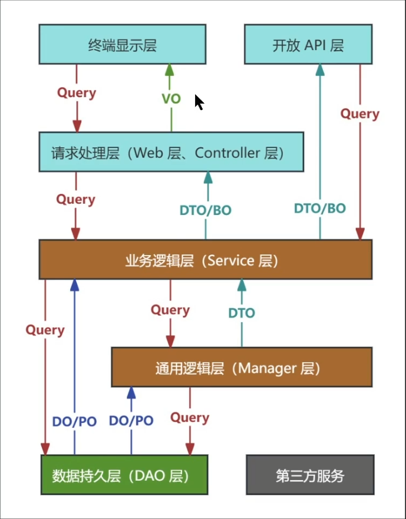

# SpringBoot
## 命名那些事



## 打印所有对象
```java
public static void main(String[] args) {
    ApplicationContext ctx = SpringApplication.run(RingApplication.class, args);
    System.out.println(ctx.getEnvironment().getProperty("server.port"));
    System.out.println(ctx.getEnvironment().getProperty("spring.application.name"));

    String[] beanNames =  ctx.getBeanDefinitionNames();
    for(String bn:beanNames){
        System.out.println(bn);
    }
}
```