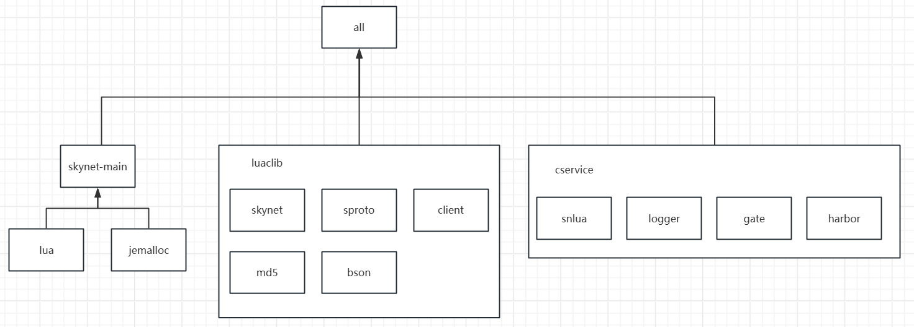

# Skynet xmake 构建

## 前言
熟悉xmake，顺便理清skynet结构，发现了skynet模块和主程序之间相互依赖，模块需要主程序暴露符号，所以要理清依赖关系需要熟读源码。

"翻译"完后让我意识到熟悉 `makefile` 的话使用 `makefile` 比较方便，但是可读性差，因此xmake还是有意义的，就好像lua和ts。

`xmake` 版本需要 `2.8.9`及以上。

> 项目地址：https://github.com/Lzeyuan/skynet-xmake.git

## 项目编译结构


## platform.mk跨平台变量
`skynet` 项目只支持 `macos`, `linux`, `freebsd`。

相比于 `makefile`， `xmake` 自带平台判断，目前只测试了 `linux`。

::: code-group

```makefile [makefile]
PLAT ?= none
PLATS = linux freebsd macosx

CC ?= gcc

.PHONY : none $(PLATS) clean all cleanall

#ifneq ($(PLAT), none)

.PHONY : default

default :
	$(MAKE) $(PLAT)

#endif

none :
	@echo "Please do 'make PLATFORM' where PLATFORM is one of these:"
	@echo "   $(PLATS)"

SKYNET_LIBS := -lpthread -lm
SHARED := -fPIC --shared
EXPORT := -Wl,-E

linux : PLAT = linux
macosx : PLAT = macosx
freebsd : PLAT = freebsd

macosx : SHARED := -fPIC -dynamiclib -Wl,-undefined,dynamic_lookup
macosx : EXPORT :=
macosx linux : SKYNET_LIBS += -ldl
linux freebsd : SKYNET_LIBS += -lrt

# Turn off jemalloc and malloc hook on macosx

macosx : MALLOC_STATICLIB :=
macosx : SKYNET_DEFINES :=-DNOUSE_JEMALLOC

linux macosx freebsd :
	$(MAKE) all PLAT=$@ SKYNET_LIBS="$(SKYNET_LIBS)" SHARED="$(SHARED)" EXPORT="$(EXPORT)" MALLOC_STATICLIB="$(MALLOC_STATICLIB)" SKYNET_DEFINES="$(SKYNET_DEFINES)"

```

```lua [xmake]
local SKYNET_LIBS = {"pthread", "m"}
local SHARED = {"-fPIC", "--shared"}
local EXPORT = "-Wl,-E"
local MALLOC_STATICLIB = ""
local SKYNET_DEFINES = ""

if is_plat("linux") then
    table.insert(SKYNET_LIBS, "dl")
    table.insert(SKYNET_LIBS, "rt")
end

if is_plat("macosx") then
    table.insert(SKYNET_LIBS, "dl")
    EXPORT = ""
    SHARED = {"-fPIC","-dynamiclib","-Wl,-undefined,dynamic_lookup"}
    MALLOC_STATICLIB = ""
    SKYNET_DEFINES  = ""
end

if is_plat("freebsd") then
    table.insert(SKYNET_LIBS, "rt")
end

-- Turn off jemalloc and malloc hook on macosx
local SKYNET_DEFINES = ""
if is_plat("macosx") then
    SKYNET_DEFINES = "-DNOUSE_JEMALLOC"
end
```

:::

## 主要逻辑

内容比较多，演示仅以 `linux` 为目标。

要注意一些 **xmake潜规则**：
- xmake默认编译全部 `target`
- `target`默认并行构建，使用 `set_policy("build.across_targets_in_parallel", false)` 关闭（全局或特定 `target`）。
- 根作用域配置应用全局
- `add_*` api 都可以通过 `public` 把配置传出去，常见情况把链接目录和头文件目录传递。
- `os.cd` 不能 `"*/*/*"` 多级切换目录，只能一个一个切换。

### 一些公共变量

::: code-group

```makefile [makefile]
LUA_CLIB_PATH ?= luaclib
CSERVICE_PATH ?= cservice
SKYNET_BUILD_PATH ?= .
CFLAGS = -g -O2 -Wall -I$(LUA_INC) $(MYCFLAGS)

# lua
LUA_STATICLIB := 3rd/lua/liblua.a
LUA_LIB ?= $(LUA_STATICLIB)
LUA_INC ?= 3rd/lua

# jemalloc
JEMALLOC_STATICLIB := 3rd/jemalloc/lib/libjemalloc_pic.a
JEMALLOC_INC := 3rd/jemalloc/include/jemalloc
MALLOC_STATICLIB := $(JEMALLOC_STATICLIB)

# TLS_MODULE=ltls
TLS_LIB=
TLS_INC=

# 源文件定义
# 这一部分xmake有通配符和子项目简化
CSERVICE = snlua logger gate harbor
LUA_CLIB = skynet \
  client \
  bson md5 sproto lpeg $(TLS_MODULE)

LUA_CLIB_SKYNET = \
  lua-skynet.c lua-seri.c \
  lua-socket.c \
  lua-mongo.c \
  lua-netpack.c \
  lua-memory.c \
  lua-multicast.c \
  lua-cluster.c \
  lua-crypt.c lsha1.c \
  lua-sharedata.c \
  lua-stm.c \
  lua-debugchannel.c \
  lua-datasheet.c \
  lua-sharetable.c \
  \

SKYNET_SRC = skynet_main.c skynet_handle.c skynet_module.c skynet_mq.c \
  skynet_server.c skynet_start.c skynet_timer.c skynet_error.c \
  skynet_harbor.c skynet_env.c skynet_monitor.c skynet_socket.c socket_server.c \
  malloc_hook.c skynet_daemon.c skynet_log.c
```

```lua [xmake]
local PLAT = "linux"
local MAKE = "make"
local CC = "gcc"
local SKYNET_BUILD_PATH = "."

-- 仅lua头文件被多处依赖
local LUA_INC = "3rd/lua"

-- 这是个 c 项目
set_toolchains("gcc")

-- CFLAGS = -g -O2 -Wall -I$(LUA_INC) $(MYCFLAGS)
set_symbols("debug")
set_optimize("faster")
set_warnings("all")
add_includedirs(LUA_INC)
-- add_cflags("")
```

:::

### cservice模块

::: code-group

```makefile [makefile]
...
CSERVICE_PATH ?= cservice
CSERVICE = snlua logger gate harbor
...
define CSERVICE_TEMP
  $$(CSERVICE_PATH)/$(1).so : service-src/service_$(1).c | $$(CSERVICE_PATH)
	$$(CC) $$(CFLAGS) $$(SHARED) $$< -o $$@ -Iskynet-src
endef

$(foreach v, $(CSERVICE), $(eval $(call CSERVICE_TEMP,$(v))))

```

```lua [xmake]
-- cservices
namespace ("cservice", function ()
    local CSERVICE = { "snlua", "logger", "gate", "harbor" }
    for _, name in ipairs(CSERVICE) do
        target(name)
            set_kind("shared")
            set_prefixname("")
            add_cflags(SHARED)
            set_targetdir("cservice")
            add_includedirs("skynet-src", LUA_INC)
            add_files("service-src/service_" .. name .. ".c")
    end
end)
```

:::

### luaclib模块
::: code-group

```makefile [makefile]
$(LUA_CLIB_PATH)/skynet.so : $(addprefix lualib-src/,$(LUA_CLIB_SKYNET)) | $(LUA_CLIB_PATH)
	$(CC) $(CFLAGS) $(SHARED) $^ -o $@ -Iskynet-src -Iservice-src -Ilualib-src

$(LUA_CLIB_PATH)/bson.so : lualib-src/lua-bson.c | $(LUA_CLIB_PATH)
	$(CC) $(CFLAGS) $(SHARED) -Iskynet-src $^ -o $@

$(LUA_CLIB_PATH)/md5.so : 3rd/lua-md5/md5.c 3rd/lua-md5/md5lib.c 3rd/lua-md5/compat-5.2.c | $(LUA_CLIB_PATH)
	$(CC) $(CFLAGS) $(SHARED) -I3rd/lua-md5 $^ -o $@ 

$(LUA_CLIB_PATH)/client.so : lualib-src/lua-clientsocket.c lualib-src/lua-crypt.c lualib-src/lsha1.c | $(LUA_CLIB_PATH)
	$(CC) $(CFLAGS) $(SHARED) $^ -o $@ -lpthread

$(LUA_CLIB_PATH)/sproto.so : lualib-src/sproto/sproto.c lualib-src/sproto/lsproto.c | $(LUA_CLIB_PATH)
	$(CC) $(CFLAGS) $(SHARED) -Ilualib-src/sproto $^ -o $@ 

$(LUA_CLIB_PATH)/ltls.so : lualib-src/ltls.c | $(LUA_CLIB_PATH)
	$(CC) $(CFLAGS) $(SHARED) -Iskynet-src -L$(TLS_LIB) -I$(TLS_INC) $^ -o $@ -lssl

$(LUA_CLIB_PATH)/lpeg.so : 3rd/lpeg/lpcap.c 3rd/lpeg/lpcode.c 3rd/lpeg/lpprint.c 3rd/lpeg/lptree.c 3rd/lpeg/lpvm.c 3rd/lpeg/lpcset.c | $(LUA_CLIB_PATH)
	$(CC) $(CFLAGS) $(SHARED) -I3rd/lpeg $^ -o $@ 
```

```lua [xmake]
-- luaclib
namespace ("luaclib", function ()
    local TLS_MODULE = ""
    local TLS_LIB= ""
    local TLS_INC= ""

    set_targetdir("luaclib")
    -- lib***.so => ***.so
    set_prefixname("")

    -- 当前作用域下所有target编译成动态库
    set_kind("shared")
    -- cflag和cc在全局配置过了
    add_cflags(SHARED)

    target("skynet", function()
        add_includedirs("skynet-src", "service-src", "lualib-src")
        add_files("lualib-src/lua-*.c", "lualib-src/lsha1.c")
    end)

    target("bson", function()
        add_includedirs("skynet-src")
        add_files("lualib-src/lua-bson.c")
    end)

    target("md5", function()
        add_includedirs("3rd/lua-md5")
        add_files("3rd/lua-md5/*.c")
    end)

    target("client", function()
        add_syslinks("pthread")
        add_files("lualib-src/lua-clientsocket.c", "lualib-src/lua-crypt.c", "lualib-src/lsha1.c")
    end)

    target("sproto", function()
        add_includedirs("lualib-src/sproto")
        add_files("lualib-src/sproto/sproto.c", "lualib-src/sproto/lsproto.c")
    end)

    -- TODO: add library
    -- target("ltls",function ()
    --     set_kind("shared")
    --     add_includedirs("skynet-src")
    --     add_linkdirs(TLS_LIB)
    --     add_includedirs(TLS_INC)
    --     add_links("ssl")
    --     add_files("lualib-src/ltls.c")
    -- end)

    target("lpeg", function()
        add_includedirs("3rd/lpeg")
        add_files("3rd/lpeg/*.c")
    end)
end)
```

:::

### 第三方库
::: code-group

``` makefile [makefile]
# lua
LUA_STATICLIB := 3rd/lua/liblua.a
LUA_LIB ?= $(LUA_STATICLIB)
LUA_INC ?= 3rd/lua

$(LUA_STATICLIB) :
	cd 3rd/lua && $(MAKE) CC='$(CC) -std=gnu99' $(PLAT)

# jemalloc
JEMALLOC_STATICLIB := 3rd/jemalloc/lib/libjemalloc_pic.a
JEMALLOC_INC := 3rd/jemalloc/include/jemalloc

all : jemalloc
	
.PHONY : jemalloc update3rd

MALLOC_STATICLIB := $(JEMALLOC_STATICLIB)

$(JEMALLOC_STATICLIB) : 3rd/jemalloc/Makefile
	cd 3rd/jemalloc && $(MAKE) CC=$(CC) 

3rd/jemalloc/autogen.sh :
	git submodule update --init

3rd/jemalloc/Makefile : | 3rd/jemalloc/autogen.sh
	cd 3rd/jemalloc && ./autogen.sh --with-jemalloc-prefix=je_ --enable-prof

jemalloc : $(MALLOC_STATICLIB)
```

```lua [xmake]
-- 3rd
namespace ("third_part", function ()
    target("jemalloc", function()
        set_kind("object")

        before_build(function (target) 
            if not os.exists("3rd/jemalloc/Makefile") then
                os.exec("git submodule update --init")
                os.cd("3rd")
                os.cd("jemalloc")
                os.exec("./autogen.sh --with-jemalloc-prefix=je_ --enable-prof")
                -- make CC=gcc
                os.exec(MAKE .. " CC=" .. CC)
            end
        end)
        
        add_linkdirs("3rd/jemalloc/lib", {public = true})
        add_links("jemalloc_pic", {public = true})
        add_includedirs("3rd/jemalloc/include/jemalloc", {public = true})
    end)

    target("lua", function()
        set_kind("phony")
        on_build(function (target) 
            if not os.exists("3rd/lua/liblua.a") then
                os.cd("3rd")
                os.cd("lua")
                -- make 'CC=gcc -std=gnu99' linux
                os.exec(MAKE  .. " CC='" .. CC .." -std=gnu99' " .. PLAT)
            end
        end)
        add_linkdirs(LUA_INC, {public = true})
        add_links("lua", {public = true})
        add_includedirs(LUA_INC, {public = true})
    end)
end)
```

:::

### skynet主程序
::: code-group

``` makefile [makefile]
$(SKYNET_BUILD_PATH)/skynet : $(foreach v, $(SKYNET_SRC), skynet-src/$(v)) $(LUA_LIB) $(MALLOC_STATICLIB)
	$(CC) $(CFLAGS) -o $@ $^ -Iskynet-src -I$(JEMALLOC_INC) $(LDFLAGS) $(EXPORT) $(SKYNET_LIBS) $(SKYNET_DEFINES)

```

```lua [xmake]
target("skynet-main", function()
    set_kind("binary")
    -- xmake默认并行构建target，导致 jemalloc 还未编译完成就直接编译 skynet-main，导致编译失败
    -- 感谢群友 Gracious 提供的方案
    -- https://github.com/xmake-io/xmake/discussions/2500
    -- https://xmake.io/#/zh-cn/guide/build_policies?id=buildacross_targets_in_parallel
    set_policy("build.across_targets_in_parallel", false)
    add_includedirs("skynet-src")
    add_syslinks(SKYNET_LIBS)
    add_ldflags(EXPORT)
    add_cflags(SKYNET_DEFINES)

    set_targetdir(os.curdir())
    set_filename("skynet")

    add_files("skynet-src/*.c")

    add_deps("third_part::jemalloc", "third_part::lua")
end)
```

:::

### 一些任务
::: code-group
```makefile [makefile]
update3rd :
	rm -rf 3rd/jemalloc && git submodule update --init

clean :
    rm -f $(SKYNET_BUILD_PATH)/skynet $(CSERVICE_PATH)/*.so $(LUA_CLIB_PATH)/*.so && \
    rm -rf $(SKYNET_BUILD_PATH)/*.dSYM $(CSERVICE_PATH)/*.dSYM $(LUA_CLIB_PATH)/*.dSYM

cleanall: clean
ifneq (,$(wildcard 3rd/jemalloc/Makefile))
	cd 3rd/jemalloc && $(MAKE) clean && rm Makefile
endif
	cd 3rd/lua && $(MAKE) clean
	rm -f $(LUA_STATICLIB)
```

```lua [xmake]
task("update3rd", function () 
    on_run(function ()
        -- clean 3rd
        local third_part_dirs = os.projectdir() .. "/3rd"
        os.cd("3rd")
        -- clean 3rd/jemalloc
        print("===== clean jemalloc =====")
        if os.exists("jemalloc/Makefile") then
            os.cd("jemalloc")
            os.exec(MAKE .. " clean")
            os.rm("Makefile")
        end
        print("===== end clean jemalloc =====")
        os.exec("git submodule update --init")
    end)

    set_menu {
        usage = "xmake update3rd",
        description = "更新第三方库",
    }
end)

-- xmake clean默认删除生成文件

task("cleanall", function () 
    on_run(function ()
        -- clean 3rd
        local third_part_dirs = os.projectdir() .. "/3rd"
        os.cd("3rd")
        -- clean 3rd/jemalloc
        print("===== clean jemalloc =====")
        if os.exists("jemalloc/Makefile") then
            os.cd("jemalloc")
            os.exec(MAKE .. " clean")
            os.rm("Makefile")
        end
        print("===== end clean jemalloc =====")

        -- clean 3rd/lua
        print("===== clean lua =====")
        os.cd(third_part_dirs)
        os.cd("lua")
        os.exec(MAKE .. " clean")
        print("===== end clean lua =====")

        -- clean project
        os.cd(os.projectdir())
        os.exec("xmake clean")
        os.rm("luaclib")
        os.rm("cservice")
    end)

    set_menu {
        usage = "xmake cleanall",
        description = "清理所有生成的文件和第三方库生成文件",
    }
end)
```

:::
