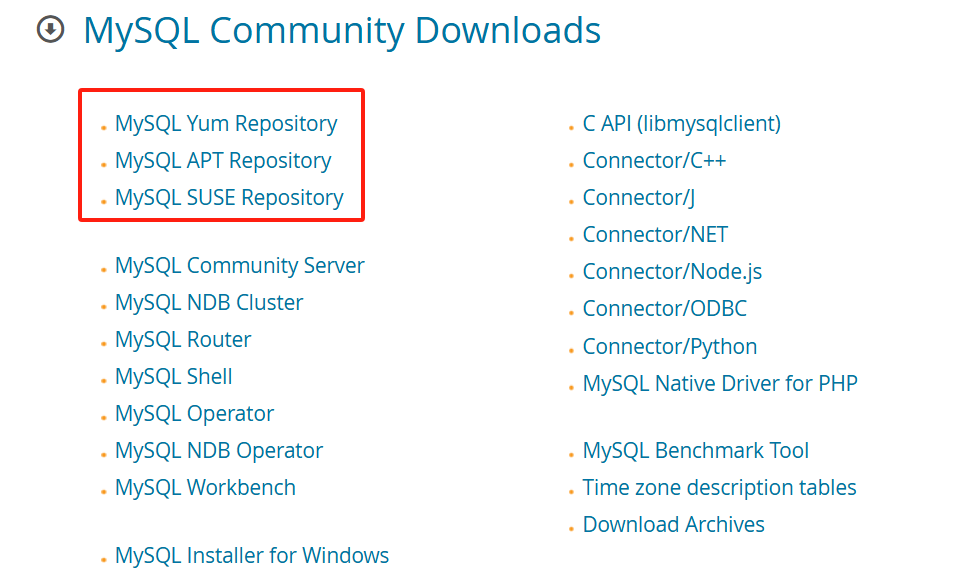

# mysql
## 1 安装
> 文档：https://dev.mysql.com/doc/refman/8.4/en/linux-installation-yum-repo.html
### 1.1 下载仓库
[下载地址](https://dev.mysql.com/downloads/) <br/>
`curl -O https://repo.mysql.com//mysql84-community-release-el9-1.noarch.rpm`

### 1.2 安装仓库
```bash
# 安装仓库
sudo yum localinstall mysql84-community-release-{platform}-{version-number}.noarch.rpm

# 查看仓库是否安装成功
yum repolist enabled | grep mysql.*-community
```

### 1.3 安装
```bash
# 安装
sudo yum install mysql-community-server

# 启动服务
systemctl start mysqld

# 查看初始密码
sudo grep 'temporary password' /var/log/mysqld.log

# 对着密码输入
mysql -uroot -p

# 修改密码
ALTER USER 'root'@'localhost' IDENTIFIED BY 'MyNewPass4!';

# 添加远程账号
CREATE USER 'username'@'%' IDENTIFIED BY 'password';

# 修改权限
GRANT ALL PRIVILEGES ON database_name.* TO 'username'@'%';
FLUSH PRIVILEGES;
```

## c/c++驱动
```bash
sudo apt install libmysqlcppconn-dev
```
```CMake
cmake_minimum_required(VERSION 3.10)

set(CMAKE_VERBOSE_MAKEFILE ON)

project(MysqlTest)

set(CMAKE_CXX_STANDARD 17)
set(CMAKE_CXX_STANDARD_REQUIRED True)  # 设置编译器需要支持C++17
set(CMAKE_CXX_EXTENSIONS False)        # 禁用编译器特定的扩展

add_executable(MysqlTest main.cpp)

# 链接库
target_link_libraries(MysqlTest mysqlcppconn)
```
```C++
#include <iostream>
#include <stdlib.h>

#include <cppconn/driver.h>
#include <cppconn/exception.h>
#include <cppconn/prepared_statement.h>
#include <cppconn/resultset.h>
#include <cppconn/statement.h>

#define EXAMPLE_HOST "192.168.1.42"
#define EXAMPLE_USER "leza"
#define EXAMPLE_PASS "LIZIEN@mysql&2024"
#define EXAMPLE_DB "test"

using namespace std;

int main(int argc, const char **argv) {
  string url(argc >= 2 ? argv[1] : EXAMPLE_HOST);
  const string user(argc >= 3 ? argv[2] : EXAMPLE_USER);
  const string pass(argc >= 4 ? argv[3] : EXAMPLE_PASS);
  const string database(argc >= 5 ? argv[4] : EXAMPLE_DB);

#if MYSQL_CONCPP_VERSION_NUMBER > 8000032
    cout << "1" << endl;
#endif
#if MYSQL_CONCPP_VERSION_NUMBER < 8000032
    cout << "2" << endl;
#endif

  cout << "Connector/C++ tutorial framework..." << endl;
  cout << endl;

  try {

    /* INSERT TUTORIAL CODE HERE! */
    // 03
    sql::Driver *driver = get_driver_instance();
    std::unique_ptr<sql::Connection> con(driver->connect(url, user, pass));
    con->setSchema(database);
    std::unique_ptr<sql::Statement> stmt(con->createStatement());

    stmt->execute("CALL get_data()");
    std::unique_ptr<sql::ResultSet> res;
    do {
      res.reset(stmt->getResultSet());
      while (res->next()) {
        cout << "Name: " << res->getString("Name")
             << " Population: " << res->getInt("Population") << endl;
      }
    } while (stmt->getMoreResults());
  } catch (sql::SQLException &e) {
    /*
      MySQL Connector/C++ throws three different exceptions:

      - sql::MethodNotImplementedException (derived from sql::SQLException)
      - sql::InvalidArgumentException (derived from sql::SQLException)
      - sql::SQLException (derived from std::runtime_error)
    */
    cout << "# ERR: SQLException in " << __FILE__;
    cout << "(" << __FUNCTION__ << ") on line " << __LINE__ << endl;
    /* what() (derived from std::runtime_error) fetches error message */
    cout << "# ERR: " << e.what();
    cout << " (MySQL error code: " << e.getErrorCode();
    cout << ", SQLState: " << e.getSQLState() << " )" << endl;

    return EXIT_FAILURE;
  }

  cout << "Done." << endl;
  return EXIT_SUCCESS;
}
```